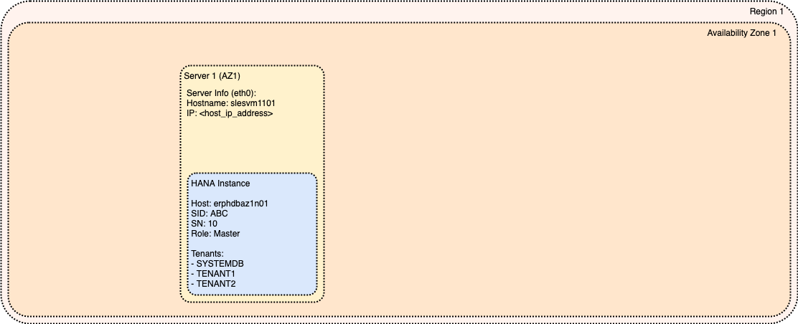
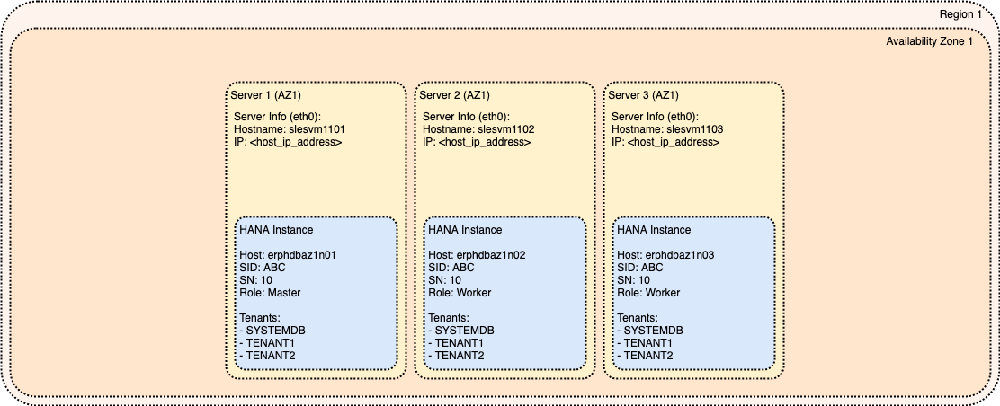

# Module: Basic Architecture

This is foundational module for SAP HANA Reference Architecture. Two basic SAP HANA deployment options are explained - Single-Node and Scale-Out.

<!-- TOC -->

- [Module: Basic Architecture](#module-basic-architecture)
  - [SAP HANA Multitenant Database Containers (MDC) vs Single-tenant Implementation](#sap-hana-multitenant-database-containers-mdc-vs-single-tenant-implementation)
  - [SAP HANA Stacking Options (MCOD, MCOS, MDC)](#sap-hana-stacking-options-mcod-mcos-mdc)
  - [Single-Node SAP HANA System (in single Availability Zone)](#single-node-sap-hana-system-in-single-availability-zone)
  - [Scale-Out SAP HANA System (in single Availability Zone)](#scale-out-sap-hana-system-in-single-availability-zone)

<!-- /TOC -->

## SAP HANA Multitenant Database Containers (MDC) vs Single-tenant Implementation

SAP HANA System can be implemented using one of two basic deployment types:

- SAP HANA Multitenant Database Containers
- SAP HANA Single-tenant Implementation

SAP HANA Multitenant Database Containers (MDC) were introduced in SAP HANA 1.0 SP09 and as of SAP HANA 2.0 SP01 the MDC concept is the only supported deployment option. Therefore, single-tenant implementation is considered outdated and is not recommended to be used.

This Reference Architecture is based on using Multitenant Database Containers deployment option however, it could be modified also for Single-tenant Implementation.

## SAP HANA Stacking Options (MCOD, MCOS, MDC)

There are different techniques how to stack multiple SAP HANA Databases on same Virtual Machine (VM):

- Multiple Components on One Database (MCOD)
- Multiple Components on One System (MCOS)
- Multitenant Database Containers (MDC)

Recommended stacking option is MDC which is fully compatible with this Reference Architecture.

Stacking option MCOD is intended to be used only in specific scenarios wherever explicitly recommended by SAP.

Stacking option MCOS is not recommended and is not aligned with this Reference Architecture.

Additional information is available in section SAP HANA: Stacking Options (MCOD, MCOS, MDC) {TODO}.

## Single-Node SAP HANA System (in single Availability Zone)

This is the simplest and most traditional deployment option. All components of SAP HANA database are running together on one single Virtual Machine (VM) having one Operating System (OS).

This deployment option is vulnerable to all failure scenarios:

- Regional failure (Disaster Event)
- Availability Zone failure
- VM failure / OS failure
- SAP HANA instance failure

Additional information:

- [Master Guide: Single-Host System](https://help.sap.com/viewer/eb3777d5495d46c5b2fa773206bbfb46/2.0.04/en-US/c79f00835b1e41f883e8a707a8254ace.html)

## Scale-Out SAP HANA System (in single Availability Zone)

This deployment option is running one SAP HANA database as multiple components distributed across multiple Virtual Machines (VMs) each having its own Operating System (OS).

SAP HANA internal architecture is based on "shared nothing" principle to allow almost linear scalability - this means that each instance (set of processes running on one Operating System) is having its own Data Files and Log Files which are NOT accessible by other instances (running on other VMs).

It is always recommended to prefer Single-Node deployment option over Scale-Out due to a performance reason. Scale-Out option is positioned to overcome the limitations of single VM (or physical server) in terms of maximal memory or CPU power.

This deployment option is not available for all SAP products - for more information check Master Guide and Installation Guide for given SAP product.

This Reference Architecture will use Scale-Out deployment option as base for all other modules. Single-Node architecture is seen as simplified version of Scale-Out deployment option. Any potential differences between Single-Node and Scale-Out designs will be explicitly highlighted.

This deployment option is vulnerable to all failure scenarios:

- Regional failure (Disaster Event)
- Availability Zone failure
- VM failure / OS failure
- SAP HANA instance failure

Note: Multiple nodes are NOT offering increased availability. Due to a "shared nothing" approach, failure on any of the nodes will impact whole SAP HANA database system.

Additional information:

- [Master Guide: Distributed System (Multiple-Host System)](https://help.sap.com/viewer/eb3777d5495d46c5b2fa773206bbfb46/2.0.04/en-US/4babf2aef5d948e39a4fc3e264c5dc6a.html)
- [Administration Guide: Multiple-Host (Distributed) Systems](https://help.sap.com/viewer/6b94445c94ae495c83a19646e7c3fd56/2.0.04/en-US/6edf6e3cca6341e1adcc99febf07dcfb.html)
