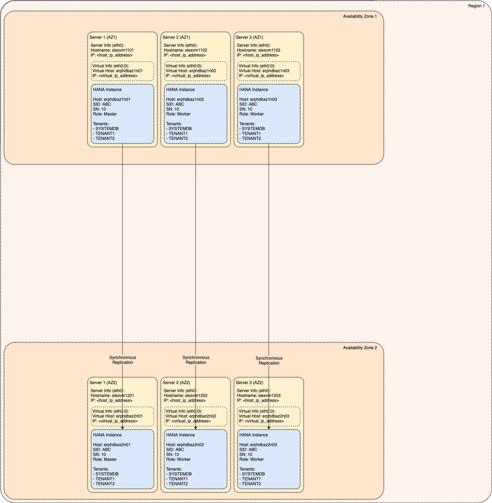
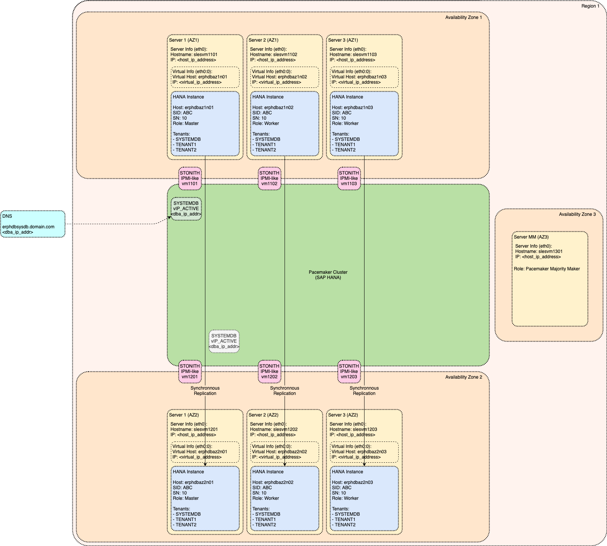
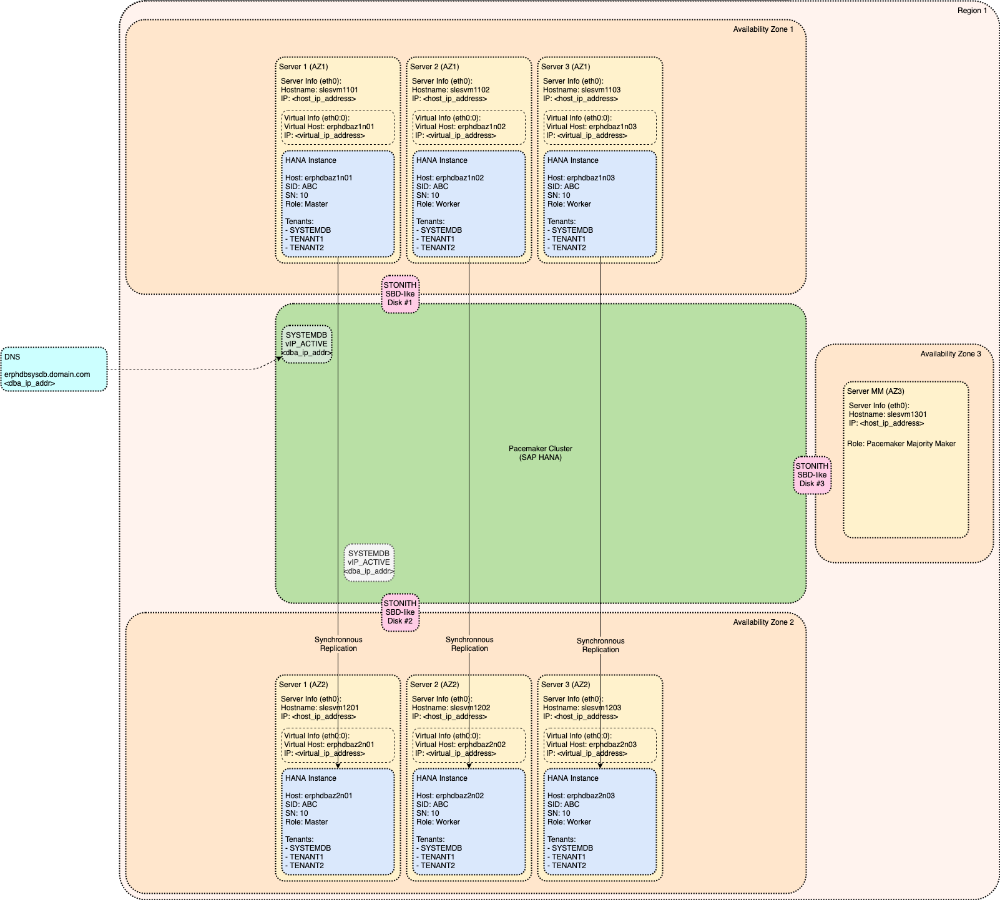
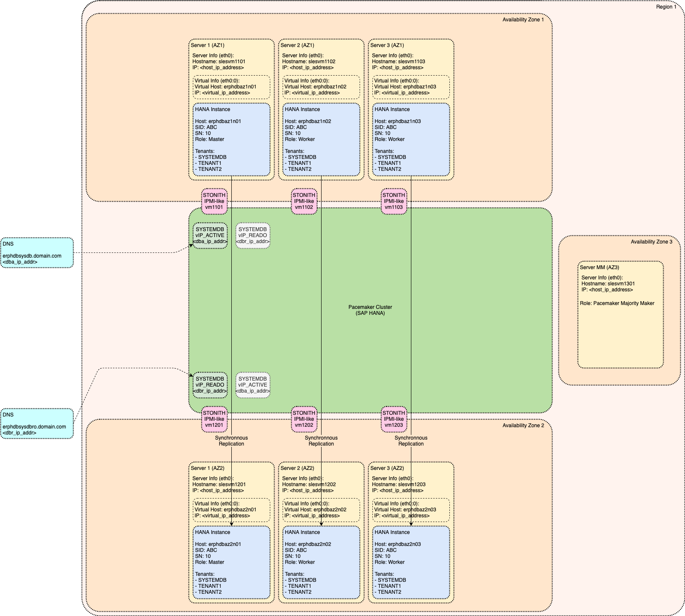
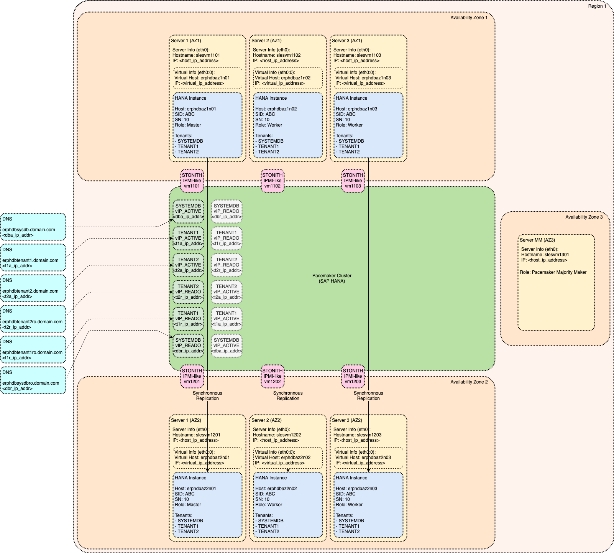

# Module: High Availability

This module is enhancing the architecture by additional SAP HANA system increasing the Availability.

High Availability scenario is based on the Pacemaker cluster automating the takeover to secondary SAP HANA system.

Different options how Cluster IP can be configured are presented - each having its own advantages and disadvantages.

<!-- TOC -->

- [Module: High Availability](#module-high-availability)
  - [Enhanced Availability without Clustering (manually operated)](#enhanced-availability-without-clustering-manually-operated)
  - [High Availability with Pacemaker Cluster](#high-availability-with-pacemaker-cluster)
    - [IPMI-like Fencing](#ipmi-like-fencing)
    - [SBD (Storage Based Death) Fencing](#sbd-storage-based-death-fencing)
    - [Majority Maker Node](#majority-maker-node)
      - [SAP HANA Scale-Out Scenario](#sap-hana-scale-out-scenario)
      - [SAP HANA Single-Node Scenario](#sap-hana-single-node-scenario)
    - [Cluster IP Design](#cluster-ip-design)
      - [Typical Cluster IP Implementation](#typical-cluster-ip-implementation)
  - [Active/Active High Availability with Pacemaker Cluster](#activeactive-high-availability-with-pacemaker-cluster)
  - [Active/Active High Availability with Pacemaker Cluster (enabled for Tenant Move)](#activeactive-high-availability-with-pacemaker-cluster-enabled-for-tenant-move)

<!-- /TOC -->

## Enhanced Availability without Clustering (manually operated)



This is the very basic option how to increase SAP HANA Availability by adding secondary SAP HANA system in separate Availability Zone and configuring synchronous SAP HANA System Replication (see [Administration Guide: Replication Modes for SAP HANA System Replication](https://help.sap.com/viewer/6b94445c94ae495c83a19646e7c3fd56/2.0.04/en-US/c039a1a5b8824ecfa754b55e0caffc01.html) for additional information).

Following two Replication Modes are acceptable for Availability management:

- Synchronous on disk (`SYNC`)
- Synchronous in-memory (`SYNCMEM`)

Synchronous on disk (`SYNC`) Replication Mode is having higher latency impact because it waits for disk write operation on secondary SAP HANA system to complete. The advantage is that Recovery Point Objective (RPO) is guaranteed to be zero (no data loss possible as long as secondary system is connected). This option is recommended in situations where we have potential Single Point of Failure (SPOF) shared between both primary and secondary SAP HANA system.

Synchronous in-memory (`SYNCMEM`) Replication Mode is having Recovery Point Objective (RPO) only "close to zero" because information on secondary SAP HANA database is written to disk asynchronously. The advantage is improved performance because the latency impact is reduced by disk write operation. However, this Replication Mode can lead to data loss in case that both primary and secondary SAP HANA system will fail at the same time - therefore it recommended only in scenarios where there is no Single Point of Failure (SPOF) shared between both primary and secondary system - for example in combination with Availability Zones.

Note that `Full Sync Option` as described in [Administration Guide: Full Sync Option for SAP HANA System Replication](https://help.sap.com/viewer/6b94445c94ae495c83a19646e7c3fd56/2.0.04/en-US/52913ed4a8db41aebef3ce4563c6f089.html) is not suitable for any High Availability usage. This is because any failure (either of primary or secondary SAP HANA System) will result in remaining SAP HANA System to be blocked.

Asynchronous (`ASYNC`) Replication Mode is not acceptable because it cannot guarantee Recovery Point Objective (RPO) to be zero or "close to zero".

In this scenario the takeover is executed manually by SAP HANA administrator (see [Administration Guide: Performing a Takeover](https://help.sap.com/viewer/6b94445c94ae495c83a19646e7c3fd56/2.0.04/en-US/123f2c8579fd452da2e7debf7cc2bd93.html) for additional information) and therefore the Recovery Time Objective (RTO) depends mainly on monitoring lag and reaction time of support teams.

There are two techniques how to ensure that application connectivity to SAP HANA database is not disrupted following the takeover operation (see [Administration Guide: Client Connection Recovery After Takeover](https://help.sap.com/viewer/6b94445c94ae495c83a19646e7c3fd56/2.0.04/en-US/c93a723ceedc45da9a66ff47672513d3.html) for additional information):

- IP redirection (referred as Cluster IP)
- DNS redirection

IP redirection (repointing Cluster IP to new primary SAP HANA system after takeover) or DNS redirection is executed manually following the takeover action.

The implementation details for Cluster IP are platform specific and are described in Platform Specific Architecture part of the documentation.

Additional Information:

- [How To SAP HANA System Replication Whitepaper](https://www.sap.com/documents/2017/07/606a676e-c97c-0010-82c7-eda71af511fa.html)
- [SAP Note 2407186: How-To Guides & Whitepapers For SAP HANA High Availability](https://launchpad.support.sap.com/#/notes/2407186)

## High Availability with Pacemaker Cluster

In order to decrease the Recovery Time Objective (RTO) the takeover process must be automated. This can be done using Pacemaker as cluster management solution.

Additional Information:

- [ClusterLabs: Pacemaker Documentation](https://clusterlabs.org/pacemaker/doc)
- [SLES12 SP4: High Availability Extension - Administration Guide](https://documentation.suse.com/en-us/sle-ha/12-SP4/single-html/SLE-HA-guide)
- [SLES15 GA: High Availability Extension - Administration Guide](https://documentation.suse.com/en-us/sle-ha/15-GA/single-html/SLE-HA-guide)
- [RHEL7: High Availability Add-On Reference](https://access.redhat.com/documentation/en-us/red_hat_enterprise_linux/7/html-single/high_availability_add-on_reference/index)

When dealing with Pacemaker cluster there are two topics that are impacting the final architecture:

- Implementation of Cluster IP
- Fencing Mechanism

Technical implementation of Cluster IP is specific to given infrastructure and therefore is in detail described in Platform Specific Architecture part of the documentation. In this section of the Reference Architecture we will only discuss generic concepts how to design Cluster IP configuration.

Fencing is critical mechanism protecting data from being corrupted. What is fencing and how it works is explained here:

- [Split-brain, Quorum, and Fencing](https://techthoughts.typepad.com/managing_computers/2007/10/split-brain-quo.html)
- [ClusterLabs: What is Fencing?](https://clusterlabs.org/pacemaker/doc/en-US/Pacemaker/2.0/html-single/Clusters_from_Scratch/index.html#_what_is_fencing)

Sections below are explaining two basic options how to implement Fencing Mechanism:

- IPMI-like Fencing
- SBD (Storage Based Death) Fencing

Recommendation which option to use on each platform is described in Platform Specific Architecture part of the documentation.

### IPMI-like Fencing



IPMI-like fencing approach is based on direct access to Management Interface of given server which is also called IPMI ([Intelligent Platform Management Interface](https://en.wikipedia.org/wiki/Intelligent_Platform_Management_Interface)) and which is having ability to power down the given server.

Here are some example implementations of IPMI-like agents:

- Amazon Web Services (AWS): [external/ec2](https://github.com/ClusterLabs/cluster-glue/blob/master/lib/plugins/stonith/external/ec2)
- Microsoft Azure: [fence_azure_arm](https://github.com/ClusterLabs/fence-agents/blob/master/agents/azure_arm/fence_azure_arm.py)
- Google Cloud Platform (GCP): [external/gcpstonith](https://storage.googleapis.com/sapdeploy/pacemaker-gcp/gcpstonith)
- On-premise Bare Metal: [external/ipmi](https://github.com/ClusterLabs/cluster-glue/blob/master/lib/plugins/stonith/external/ipmi)

All of these agents are having same purpose - to kill the Virtual Machine or Bare Metal Server as soon as technically possible. The goal is not to perform graceful shutdown but to immediately terminate the server to ensure that it is down before secondary server can takeover.

In cluster configuration each SAP HANA server needs to have its own IPMI-like fencing agent configured and fully operational. The IPMI-like fencing agent is always called from the remote side (for example secondary systems are fencing off primary systems).

### SBD (Storage Based Death) Fencing



SBD (Storage Based Death) fencing is based on different approach.

The SBD device is shared raw disk (can be connected via Fibre Channel, Fibre Channel over Ethernet or iSCSI) that is used to send messages to other nodes.

When SBD device is initiated it will overwrite the beginning of the disk device with messaging slot structure. This structure is used by individual nodes to send messages to other nodes. Each cluster node is running SBD daemon that is watching the slot dedicated to given node and performing associated actions.

In case of fencing event the node that is triggering the fencing will write the "poison pill" message to the slot associated with target system. SBD daemon on target system is monitoring given slot and once it will read the "poison pill" message it will execute suicide action (self-fencing itself from the cluster by instant powering off).

Here is implementation of SBD agent:

- [external/sbd](https://github.com/ClusterLabs/cluster-glue/blob/a858a7509eb4c178bfaacc14dc5f053e2384bb89/lib/plugins/stonith/external/sbd)

Recommended amount of SBD devices is either:

- Three SBD devices - each in separate Availability Zone (visualized on picture above)
- One SBD device - in 3rd Availability Zone (other than used by SAP HANA VMs)

Additional Information:

- [Linux-HA: SBD Fencing](http://linux-ha.org/wiki/SBD_Fencing)
- [sbd - STONITH Block Device daemon](https://github.com/ClusterLabs/sbd/blob/master/man/sbd.8.pod)

### Majority Maker Node

As said above Fencing concept is vital to protect the data from corruption. However, in case of communication issues between cluster nodes there is risk that individual nodes will continuously keep fencing each other by taking over the role of primary system.

Therefore, there is second equally important concept called Quorum that is deciding which subgroup of cluster nodes is entitled to become primary.

#### SAP HANA Scale-Out Scenario

Most simple implementation of Quorum is to use odd number of nodes and base the Quorum logic on majority of nodes in subgroup.

This method is applicable to SAP HANA Scale-Out configurations where we have same number of nodes on each Availability Zone and we need one additional VM in 3rd Availability Zone to act as "Majority Maker" helping to decide which side will become primary.

Recommended settings are described in [SLES12 SP2: SAP HANA System Replication Scale-Out - Cluster Bootstrap and more](https://documentation.suse.com/sbp/all/single-html/SLES4SAP-hana-scaleOut-PerfOpt-12/#_cluster_bootstrap_and_more).

#### SAP HANA Single-Node Scenario

Concept of using "Majority Maker" is also applicable to SAP HANA Single-Node implementations (two node clusters). However, such small clusters can be also implemented using special `two_node` Quorum approach as described in [SLES12 SP4: High Availability Extension - Corosync Configuration for Two-Node Clusters](https://documentation.suse.com/en-us/sle-ha/12-SP4/single-html/SLE-HA-guide/#sec-ha-config-basics-corosync-2-node):

```yaml
quorum {
 provider: corosync_votequorum
 expected_votes: 2
 two_node: 1
}
```

Note that setting `two_node: 1` value will implicitly configure `wait_for_all: 1`.

The configuration is explained in `votequorum` man pages [Man Pages: VOTEQUORUM(5)](http://www.polarhome.com/service/man/generic.php?qf=votequorum&af=0&tf=2&of=RedHat&print=1) and in following document [New quorum features in Corosync 2](http://people.redhat.com/ccaulfie/docs/Votequorum_Intro.pdf).

Effectively the configuration setting is adjusting how Quorum is calculated. When cluster is started for the first time (both nodes down) then `wait_for_all: 1` parameter is ensuring that both nodes need to be available to achieve the quorum. This is critical to protect the consistency of data as explained in following blogs:

- [Be Prepared for Using Pacemaker Cluster for SAP HANA – Part 1: Basics](https://blogs.sap.com/2017/11/19/be-prepared-for-using-pacemaker-cluster-for-sap-hana-part-1-basics)
- [Be Prepared for Using Pacemaker Cluster for SAP HANA – Part 2: Failure of Both Nodes](https://blogs.sap.com/2017/11/19/be-prepared-for-using-pacemaker-cluster-for-sap-hana-part-2-failure-of-both-nodes)

However, if the cluster is already active (and Quorum was achieved) then parameter `two_node: 1` will ensure that in case that one node will fail the other node is still having Quorum even if it is not having majority.

In case of split-brain situation (when both nodes are active however unable to communicate), both nodes will have Quorum and both nodes will race to fence the other node. The node that will win the race will be primary.

This option is applicable only to Single-Node scenario where we have one SAP HANA System in each Availability Zone. In such case "Majority Maker" VM in 3rd Availability Zone is not required (although possible).

### Cluster IP Design

The simplest SAP HANA High Availability scenario needs only one Cluster IP that is following Active Nameserver of primary SAP HANA system (which is where System Database is available).

Each tenant in SAP HANA system is having its own ports that can be used to directly connect to given Tenant Database. Although this direct connection is possible it is recommended to connect indirectly by specifying the port for the System Database (`3xx13` for ODBC/JDBC/SQLDBC access) and the Tenant Database name. SAP HANA system will ensure that connection is internally rerouted to target Tenant Database.

In case of takeover event the Pacemaker cluster will ensure that Cluster IP is moved to new primary SAP HANA system.

As explained above the technical implementation of Cluster IP is in detail covered in Platform Specific Architecture part of the documentation.

Additional Information:

- [Administration Guide: Server Components of the SAP HANA Database](https://help.sap.com/viewer/6b94445c94ae495c83a19646e7c3fd56/2.0.04/en-US/f0e6eb689f5648899749389c0894fd25.html)
- [Tenant Databases: Connections for Tenant Databases](https://help.sap.com/viewer/78209c1d3a9b41cd8624338e42a12bf6/2.0.04/en-US/7a9343c9f2a2436faa3cfdb5ca00c052.html)
- [Tenant Databases: Scale-Out Architecture of Tenant Databases](https://help.sap.com/viewer/78209c1d3a9b41cd8624338e42a12bf6/2.0.04/en-US/999c782cc4d0485ea04a70966b6aabad.html)
- [Administration Guide: Connections from Database Clients and Web Clients to SAP HANA](https://help.sap.com/viewer/6b94445c94ae495c83a19646e7c3fd56/2.0.04/en-US/37d2573cb24e4d75a23e8577fb4f73b7.html)
- [Administration Guide: Connections for Distributed SAP HANA Systems](https://help.sap.com/viewer/6b94445c94ae495c83a19646e7c3fd56/2.0.04/en-US/82cea8fe69604f3ab0d4624248b6e523.html)
- [TCP/IP Ports of All SAP Products](https://help.sap.com/viewer/ports)

#### Typical Cluster IP Implementation

Traditional implementation of Cluster IP is based on ARP cache invalidation. On primary server Pacemaker Cluster will define Cluster IP address by using command `ip addr add` combined with ARP cache invalidation via `arping` (see [ClusterLabs / resource-agents / heartbeat / IPaddr2](https://github.com/ClusterLabs/resource-agents/blob/5b18c216eae233751b243301255ae610cd49e52c/heartbeat/IPaddr2#L636)). During the takeover the Pacemaker Cluster will remove Cluster IP address from old primary server by using command `ip addr del` and it will recreate it on new primary server using commands mentioned above. The key requirement here is that both primary and secondary server are in same subnet so that Cluster IP address can be moved between them.

## Active/Active High Availability with Pacemaker Cluster



Historically secondary SAP HANA System was closed, and connection attempts were rejected (this is still valid for Operation Modes `delta_datashipping` or `logreplay`).

Since SAP HANA 2.0 new operation mode `logreplay_readaccess` is available which is offering capability to open secondary SAP HANA System for read-only access.

As explained in SAP HANA [Administration Guide: Connection Types](https://help.sap.com/viewer/6b94445c94ae495c83a19646e7c3fd56/2.0.04/en-US/4032ccbf61e44062bbddde7cc60d63b9.html) and in [Administration Guide: Virtual IP Address Handling](https://help.sap.com/viewer/6b94445c94ae495c83a19646e7c3fd56/2.0.04/en-US/ac3a1f1955fd4919a8d51e30a54702cd.html) secondary Cluster IP following Active Nameserver of secondary SAP HANA system is required.

During normal operation both Cluster IP addresses are anti-collocated to each other - primary Cluster IP address is following primary SAP HANA System and secondary Cluster IP address is following secondary SAP HANA System.

As part of takeover event the Pacemaker cluster will switch location of both IP addresses along with change of primary and secondary roles of SAP HANA Systems.

Additional Information:

- [Administration Guide: Active/Active (Read Enabled)](https://help.sap.com/viewer/6b94445c94ae495c83a19646e7c3fd56/2.0.04/en-US/fe5fc53706a34048bf4a3a93a5d7c866.html)
- [Administration Guide: Connection Types](https://help.sap.com/viewer/6b94445c94ae495c83a19646e7c3fd56/2.0.04/en-US/4032ccbf61e44062bbddde7cc60d63b9.html)
- [Administration Guide: Virtual IP Address Handling](https://help.sap.com/viewer/6b94445c94ae495c83a19646e7c3fd56/2.0.04/en-US/ac3a1f1955fd4919a8d51e30a54702cd.html)

## Active/Active High Availability with Pacemaker Cluster (enabled for Tenant Move)



SAP HANA is offering option to move Tenant Database from existing SAP HANA System to new SAP HANA System having different `SID` and `system_number`.

Architecture documented in previous section is having one big limitation related to Tenant Move operation. The design is supporting multiple Tenant Databases on one SAP HANA cluster however, all tenants are accessed over one shared Cluster IP.

In such configuration when Tenant Database is moved, all applications connecting to this Tenant Database must be reconfigured to use Cluster IP of target SAP HANA cluster.

To make Tenant Move operation as seamless as possible each tenant needs to have its own Cluster IP that will be moved to target SAP HANA cluster along with given tenant.

All tenant-specific Cluster IPs are implemented in same way as System Database Cluster IP, they are following Active Nameserver of primary SAP HANA system - which is where System Database, used to connect to individual tenants, is available.

Second challenge that needs to be addressed is port used for connecting to System Database (`3xx13` for ODBC/JDBC/SQLDBC access). This port is dependent on `system_number` of given SAP HANA System and therefore can differ. Solution to this problem is to allocate additional port (same across all SAP HANA Systems) on which System Database Tenant will listen. The procedure is described in [Administration Guide: Configure Host-Independent Tenant Addresses](https://help.sap.com/viewer/6b94445c94ae495c83a19646e7c3fd56/2.0.04/en-US/7fb37b4733fe44d08dfabca03845060b.html).

The procedure how to relocate Tenant Database to new SAP HANA System is described in [SAP HANA Tenant Move](../pages/operational_procedures/process_tenant_move.md#sap-hana-tenant-move).

Additional Information:

- [Administration Guide: Copying and Moving Tenant Databases](https://help.sap.com/viewer/6b94445c94ae495c83a19646e7c3fd56/2.0.04/en-US/843022db7b80427ea53b4e55c2bba0bd.html)
- [Administration Guide: Configure Host-Independent Tenant Addresses](https://help.sap.com/viewer/6b94445c94ae495c83a19646e7c3fd56/2.0.04/en-US/7fb37b4733fe44d08dfabca03845060b.html)
