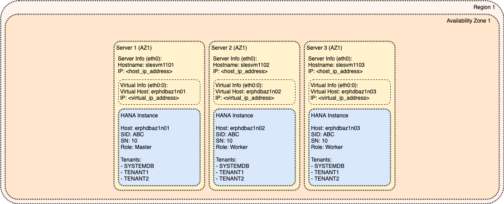

# Module: Virtual Hostname/IP

In this module the basic architecture is extended by decoupling SAP HANA installation from OS installation by using Virtual Hostname and Virtual IP address dedicated to SAP HANA instance.

This module is prerequisite to support Instance Move as documented in [SAP HANA Instance Move](../pages/operational_procedures/process_instance_move.md#sap-hana-instance-move).

<!-- TOC -->

- [Module: Virtual Hostname/IP](#module-virtual-hostnameip)
  - [Concept of Virtual Hostname and Virtual IP](#concept-of-virtual-hostname-and-virtual-ip)

<!-- /TOC -->

## Concept of Virtual Hostname and Virtual IP

Hostname and IP address is critical attribute uniquely identifying Operating System running on given Virtual Machine (VM). It is registered in many backend Systems of Management (including Active Directory integration, DNS integration, OS monitoring, etc.) and Systems of Records. Since is tightly coupled with the identity of given Operating System quite often it cannot be easily changed.

However, SAP HANA instance must be installed against some Hostname (see [Administration Guide: Default Host Names and Virtual Host Names](https://help.sap.com/viewer/6b94445c94ae495c83a19646e7c3fd56/2.0.04/en-US/aa7e697ccf214852a283a75126c34370.html) for additional information). Unless specific Hostname is provided then Hostname of Operating System is used.

Hostname used to install SAP HANA and its Fully Qualified Domain Name (FQDN) form is playing critical role in regard to connected applications and usage of Certificates to encrypt network communication (see [Security Guide: TLS/SSL Configuration on the SAP HANA Server](https://help.sap.com/viewer/b3ee5778bc2e4a089d3299b82ec762a7/2.0.04/en-US/de15ffb1bb5710148386ffdfd857482a.html) for additional information).

Therefore, many customers are having requirement to preserve the Hostname used during SAP HANA installation so that external connectivity is not disrupted following the migration.

Unfortunately, this is in direct contradiction with requirement to have different Hostname during SAP HANA System Replication which is recommended option how to minimize the business downtime during homogeneous migration of SAP HANA system (see [Administration Guide: General Prerequisites for Configuring SAP HANA System Replication](https://help.sap.com/viewer/6b94445c94ae495c83a19646e7c3fd56/2.0.04/en-US/86267e1ed56940bb8e4a45557cee0e43.html) for additional information).

Convenient solution is usage of Virtual Hostname and Virtual IP for SAP HANA installation that is always following given SAP HANA instance. The advantage is that SAP HANA installation is decoupled from Operating System and can be easily relocated to new Operating System.

The procedure how to relocate SAP HANA system using Virtual Hostname/IP is described in [SAP HANA Instance Move](../pages/operational_procedures/process_instance_move.md#sap-hana-instance-move).

The real implementation of Virtual Hostname is platform specific and is described in detail in Platform Specific Architecture part of the documentation.

Note the difference between the Virtual Hostname/IP and Cluster Hostname/IP. Purpose of Cluster Hostname/IP is to always to follow "active" instance of SAP HANA High Availability (HA) solution while Virtual Hostname/IP is static and is always following given instance regardless of its role in HA solution.
