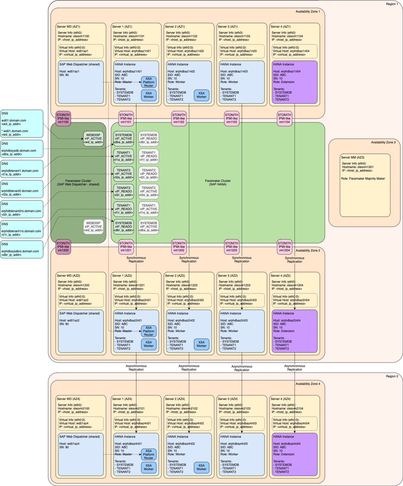

# Module: SAP XSA

SAP HANA extended application services, advanced model (XSA) is application server platform used for the development and execution of native data-intensive applications. This module is explaining how to implement SAP XSA as part of this Reference Architecture.

<!-- TOC -->

- [Module: SAP XSA](#module-sap-xsa)
  - [Reference Architecture of SAP XSA](#reference-architecture-of-sap-xsa)
    - [Additional Host Roles](#additional-host-roles)
    - [Tenant Database Installation](#tenant-database-installation)
    - [Routing Mode](#routing-mode)
    - [Usage of Dedicated SAP Web Dispatcher](#usage-of-dedicated-sap-web-dispatcher)

<!-- /TOC -->

## Reference Architecture of SAP XSA

### Additional Host Roles

Architecture of SAP XSA is introducing new host roles:

- `xs_worker` for active SAP XSA host running XSA applications
- `xs_standby` not used as part of this Reference Architecture - it is used only in case of SAP Host Auto-Failover High Availability option (as documented in section [Alternative Implementations](alternative_implementations.md#alternative-implementations))

These roles can be assigned automatically (each SAP HANA database `worker` host is assigned SAP XSA `xs_worker` role) or manually (only selected hosts are assigned `xs_worker` role or there can even be dedicated `xs_worker` host).

Additional Information:

- [Installation and Update Guide: System Concepts for XS Advanced Runtime Installations](https://help.sap.com/viewer/2c1988d620e04368aa4103bf26f17727/2.0.04/en-US/73596bf87326455e8f2c10b83580d91b.html)

### Tenant Database Installation

As of SAP HANA 2.0 SP03 (revision 34) there is option to choose between installation of XSA Technical data into System Database Tenant or into separate Tenant Database.

XSA Platform is recognizing following data types:

- XSA Technical Data (one set of data shared for all Customer XSA Applications)
  - Users (including users for Customer XSA Applications)
  - Platform Data (applications, build packs, runtime information, etc.)
  - System Application Data (audit log service, deploy service, etc.)
- XSA Custom Application Data (data for Customer XSA Applications)

XSA Custom Application Data is always stored in Tenant Database. Additional Tenant Databases can be configured to separate data belonging to different XSA Custom Applications.

XSA Technical Data can be stored either in System Database Tenant (default option) or in Tenant Database along with XSA Customer Application Data (available since SAP HANA 2.0 SP03 (revision 34)).

Since installing XSA Technical Data in System Database Tenant is making Tenant Move operation impossible, it is recommended to install XSA Technical Data into Tenant Database wherever possible. However, please note the technical restrictions as described in [Installation and Update Guide: Installing XS Advanced in a Tenant Database](https://help.sap.com/viewer/2c1988d620e04368aa4103bf26f17727/2.0.04/en-US/be61eaff568a4fcfbefe5644678cd0d4.html).

Additional Information:

- [Installation and Update Guide: XS Advanced Database Setup Options](https://help.sap.com/viewer/2c1988d620e04368aa4103bf26f17727/2.0.04/en-US/9e27727aac8842ef9fb8431525e97a55.html)
- [Installation and Update Guide: Installing XS Advanced in the System Database](https://help.sap.com/viewer/2c1988d620e04368aa4103bf26f17727/2.0.04/en-US/7ff111fa3873400696549ee721ff58f5.html)
- [Installation and Update Guide: Installing XS Advanced in a Tenant Database](https://help.sap.com/viewer/2c1988d620e04368aa4103bf26f17727/2.0.04/en-US/be61eaff568a4fcfbefe5644678cd0d4.html)

### Routing Mode

SAP XSA is offering option to use either "port based routing mode" or "hostname based routing mode". This Reference Architecture is based on using "hostname based routing mode" which is recommended for productive use.

Additional Information:

- [Installation and Update Guide: Setting Up the XS Advanced Runtime Behind a Reverse Proxy](https://help.sap.com/viewer/2c1988d620e04368aa4103bf26f17727/2.0.04/en-US/ccfa0802014c4cba9fd2777b53385421.html)
- [SAP Note 2245631: Routing Mode and Default Domain configuration for SAP HANA extended application services, advanced model](https://launchpad.support.sap.com/#/notes/2245631)

### Usage of Dedicated SAP Web Dispatcher

XSA Platform Router is central entry point for all XSA applications. In case of SAP HANA Scale-Out system, the XSA component will automatically start and maintain its own internal SAP Web Dispatcher process that will forward the request to other hosts. This behavior is described in [Administration Guide: Multi-Host Setup with XS Advanced](https://help.sap.com/viewer/6b94445c94ae495c83a19646e7c3fd56/2.0.04/en-US/c3324f154c314febb8e3179137c037b0.html)

Note that XSA Platform Router (`xscontroller` service) can run on different host, other than host where Active Nameserver service (associated with Cluster IP) is running. So additional Cluster IP dedicated for XSA Platform Router would be required to support High Availability scenario.

Different approach is usage of Failover Router (external SAP Web Dispatcher) acting as Reverse Proxy dispatching the XSA requests to XSA Platform Router running on currently active SAP HANA System.

This Reference Architecture is based on external Highly Available SAP Web Dispatcher protected by its own Pacemaker Cluster. This SAP Web Dispatcher can be shared for multiple SAP HANA systems and since it will act as "Single Point of Entry" it will make "Tenant Move" operation easier to execute.

Additional Information:

- [Installation and Update Guide: Setting Up the XS Advanced Runtime Behind a Reverse Proxy](https://help.sap.com/viewer/2c1988d620e04368aa4103bf26f17727/2.0.04/en-US/ccfa0802014c4cba9fd2777b53385421.html)
- [SAP Note 2300936: Host Auto-Failover & System Replication Setup with SAP HANA extended application services, advanced model](https://launchpad.support.sap.com/#/notes/2300936)
