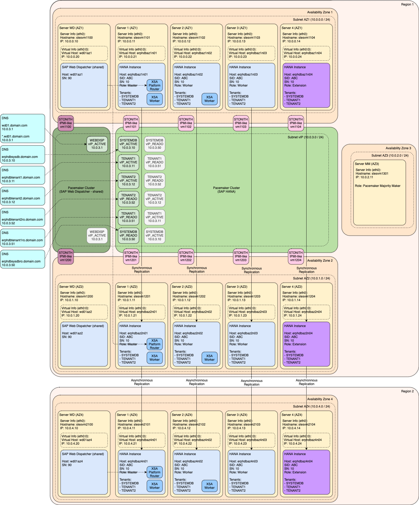
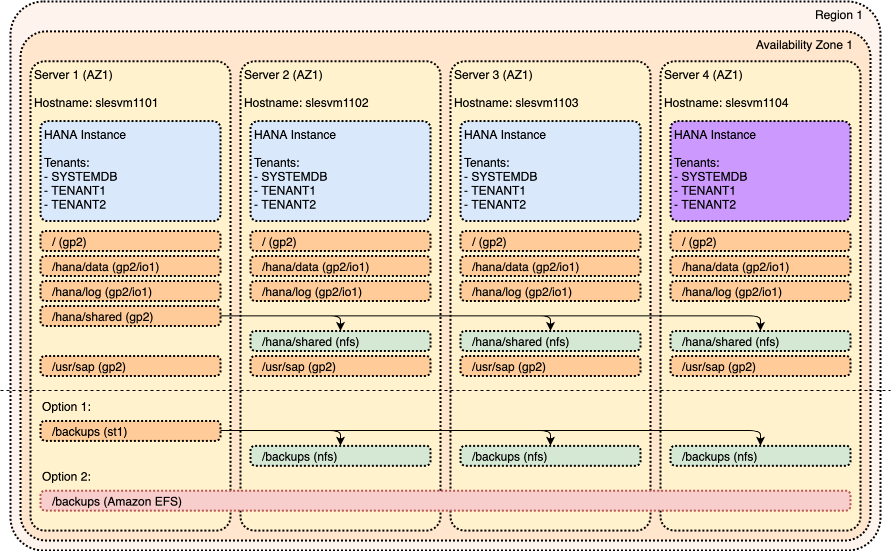

# Platform Specific Architecture for AWS (Amazon Web Services)

- [Platform Specific Architecture for AWS (Amazon Web Services)](#platform-specific-architecture-for-aws-amazon-web-services)
  - [AWS: Overall Architecture](#aws-overall-architecture)
  - [AWS: Basic Architecture](#aws-basic-architecture)
    - [AWS: Supported Instance Types for SAP HANA](#aws-supported-instance-types-for-sap-hana)
    - [AWS: Storage Setup for SAP HANA Implementation](#aws-storage-setup-for-sap-hana-implementation)
    - [AWS: Networking specifics for AWS Availability Zones](#aws-networking-specifics-for-aws-availability-zones)
  - [AWS: Virtual Hostname/IP](#aws-virtual-hostnameip)
    - [AWS: Generic implementation steps](#aws-generic-implementation-steps)
    - [AWS: Additional comments](#aws-additional-comments)
      - [AWS: SAP HANA inbound network communication](#aws-sap-hana-inbound-network-communication)
      - [AWS: SAP HANA outbound network communication](#aws-sap-hana-outbound-network-communication)
  - [AWS: High Availability](#aws-high-availability)
    - [AWS: High Availability across Availability Zones](#aws-high-availability-across-availability-zones)
      - [AWS: Which Availability Zone to use](#aws-which-availability-zone-to-use)
    - [AWS: Available Fencing mechanism](#aws-available-fencing-mechanism)
    - [AWS: Implementation of Cluster IP](#aws-implementation-of-cluster-ip)
  - [AWS: Disaster Recovery](#aws-disaster-recovery)
  - [AWS: Data Tiering Options](#aws-data-tiering-options)
    - [AWS: Persistent Memory (NVRAM)](#aws-persistent-memory-nvram)
    - [AWS: SAP HANA Native Storage Extensions (NSE)](#aws-sap-hana-native-storage-extensions-nse)
    - [AWS: SAP HANA Extension Nodes](#aws-sap-hana-extension-nodes)
    - [AWS: SAP HANA Dynamic Tiering (DT)](#aws-sap-hana-dynamic-tiering-dt)
  - [AWS: XSA](#aws-xsa)

## AWS: Overall Architecture

Following diagram is illustrating complete version of Reference Architecture for SAP HANA tailored for AWS (Amazon Web Services).

For detailed explanation of individual modules please see individual sections in [Generic SAP HANA Architecture](../../README.md#table-of-content).

You can also review official AWS Reference Architecture and other documentation:

- [AWS: SAP on AWS Technical Documentation: SAP HANA](https://aws.amazon.com/sap/docs/#SAP_HANA)
- [AWS: SAP HANA on the AWS Cloud: Quick Start Reference Deployment](https://docs.aws.amazon.com/quickstart/latest/sap-hana/welcome.html)
- [AWS: Multi-AZ (HA), Single-Node Architecture](https://docs.aws.amazon.com/quickstart/latest/sap-hana/multi-az-single.html)

## AWS: Basic Architecture

Link to generic content: [Module: Basic Architecture](../generic_architecture/module_basic_architecture.md#module-basic-architecture)

### AWS: Supported Instance Types for SAP HANA

Not every instance type is supported for productive SAP HANA usage.

Official list of SAP certified instance types is available at [SAP: The SAP HANA Hardware Directory](https://www.sap.com/dmc/exp/2014-09-02-hana-hardware/enEN/iaas.html#categories=Amazon%20Web%20Services). This should always be used to decide whether the particular instance type is supported for SAP HANA or not.

AWS specific list of certified instances with additional details can be found in [AWS: SAP HANA on AWS Quick Start Guide: AWS Instance Types for SAP HANA](https://docs.aws.amazon.com/quickstart/latest/sap-hana/instances.html)

### AWS: Storage Setup for SAP HANA Implementation

SAP HANA Storage Configuration is coming in two flavors:

- General Purpose SSD (`gp2`) storage - cheaper storage that meets SAP KPI requirements for most of the SAP HANA workloads
- Provisioned IOPS SSD (`io1`) storage - high-performance storage intended for most demanding SAP HANA workloads

Following disk setup is recommended:

| Filesystem    | Name             | Device type  | Comment
|:--------------|:-----------------|:-------------|:----------------
| /             | Root volume      | gp2          |
| /hana/data    | SAP HANA data    | gp2 / io1    |
| /hana/log     | SAP HANA logs    | gp2 / io1    |
| /hana/shared  | SAP HANA shared  | gp2          | Provisioned to the master, NFS-mounted on other nodes
| /usr/sap      | SAP binaries     | gp2          |
| /backups      | SAP HANA backup  | st1          | Provisioned to the master, NFS-mounted on other nodes
| /backups      | SAP HANA backup  | Amazon EFS   | Alternative option for SAP HANA backup filesystem

Instance specific sizing recommendations are available at [AWS: SAP HANA on AWS Quick Start Guide: Storage Configuration for SAP HANA](https://docs.aws.amazon.com/quickstart/latest/sap-hana/storage.html).

### AWS: Networking specifics for AWS Availability Zones

As visualized on the Overall Architecture diagram - in AWS each Availability Zone is having its own subnet. It is not possible to stretch one subnet across multiple Availability Zones. This needs to be taken into consideration during deployment planning.

Impact on implementation of Cluster IP in AWS is described in [AWS: High Availability](#aws-high-availability).

## AWS: Virtual Hostname/IP

Link to generic content: [Module: Virtual Hostname/IP](../generic_architecture/module_virtual_hostname.md#module-virtual-hostnameip)

This chapter describes recommended implementation of Virtual Hostname and Virtual IP for an SAP HANA installation on the AWS cloud.

The implementation is based on assigning a _Secondary private IP address_ to an existing network interface of the AWS instance. A _Secondary private IP address_ can be easily reassigned to another AWS instance and so it can follow SAP HANA instance relocation. For more details see [AWS: Multiple IP Addresses](https://docs.aws.amazon.com/AWSEC2/latest/UserGuide/MultipleIP.html). This _Secondary private IP address_ is associated with the Virtual Hostname which is used during SAP HANA instance installation.

### AWS: Generic implementation steps

- define Virtual IP (in the same subnet as the network interface) and Virtual Hostname for SAP HANA Instance
- assign _Virtual IP_ as _Secondary private IP address_ to existing network interface (see [AWS: assign secondary private IP](https://docs.aws.amazon.com/AWSEC2/latest/UserGuide/MultipleIP.html#assignIP-existing))
- configure OS to use _Virtual IP Address_ (e.g. [SUSE: Administration Guide - Configuring Multiple Addresses](https://documentation.suse.com/sles/12-SP4/single-html/SLES-admin/index.html#sec-basicnet-yast-configure-addresses))
- make Virtual Hostname resolvable (e.g. updating `/etc/hosts`)
- install SAP HANA instance with the _Virtual Hostname_ (see [SAP: Administration Guide - Default Host Names and Virtual Host Names](https://help.sap.com/viewer/6b94445c94ae495c83a19646e7c3fd56/2.0.04/en-US/aa7e697ccf214852a283a75126c34370.html))

**Note:** _Virtual IP_ can be be reassigned to another AWS instance thanks to option "_Allow reassignment_" of the network interface (see [AWS: assign a secondary private IPv4 address](https://docs.aws.amazon.com/AWSEC2/latest/UserGuide/MultipleIP.html#assignIP-existing))

### AWS: Additional comments

#### AWS: SAP HANA inbound network communication

A network communication initiated from a remote system to the Virtual IP of SAP HANA instance is established and takes place between remote system IP and the Virtual IP (_Secondary private IP address_).
The _Primary private IP address_ on the same interface is not involved in this communication.

#### AWS: SAP HANA outbound network communication

In contrast to an inbound connection, when SAP HANA instance initiates a network connection to a remote system the _Primary private IP address_ is used as source IP instead of Virtual IP (_Secondary private IP address_).  
If there is requirement to use Virtual IP as the source IP, it could be achieved by means of linux routing. The core of the idea is to add route specifying source address like `ip route add <network/mask> via <gateway> src <virtual_ip>` (see [Routing for multiple uplinks/providers](https://www.tldp.org/HOWTO/Adv-Routing-HOWTO/lartc.rpdb.multiple-links.html#AEN258)).

## AWS: High Availability

Link to generic content: [Module: High Availability](../generic_architecture/module_high_availability.md#module-high-availability)

### AWS: High Availability across Availability Zones

Best practice for deploying SAP HANA is to stretch High Availability cluster across Availability Zones. Each AWS Availability Zone is physically separate infrastructure, therefore deploying High Availability across Availability Zones ensures that there is no shared single-point-of-failure (SPOF) between primary and secondary SAP HANA system. This approach is significantly increasing overall resiliency of the High Availability of the solution.

List of existing Availability Zones for individual AWS Regions is available here: [AWS: Regions and Availability Zones](https://aws.amazon.com/about-aws/global-infrastructure/regions_az).

#### AWS: Which Availability Zone to use

Most critical factor for selecting Availability Zones is network latency. Latency between individual Availability Zones can significantly differ and therefore it is important to measure network latency using SAP `niping` tool (see [SAP Note 500235: Network Diagnosis with NIPING](https://launchpad.support.sap.com/#/notes/500235) for additional information) and select Availability Zones with minimal latency.

Furthermore, it is important to note that internal numbering of Availability Zones is specific for each individual AWS account. Therefore, the network latency test must be performed in given account. For additional information please see [AWS: Regions, Availability Zones, and Local Zones - Availability Zones](https://docs.aws.amazon.com/AWSEC2/latest/UserGuide/using-regions-availability-zones.html#concepts-availability-zones).

Last thing to consider is whether desired instance types are available inside selected Availability Zones as not all Availability Zones are offering all instance types.

### AWS: Available Fencing mechanism

AWS is using IPMI-like Fencing (see [Module: High Availability - IPMI-like Fencing](../generic_architecture/module_high_availability.md#ipmi-like-fencing) for additional details). SBD (Storage Based Death) Fencing is not available in AWS.

Fencing agent source code is available here: [external/ec2](https://github.com/ClusterLabs/cluster-glue/blob/master/lib/plugins/stonith/external/ec2). Behind the scenes it is using [StopInstances](https://docs.aws.amazon.com/AWSEC2/latest/APIReference/API_StopInstances.html) API call with `force` option. This will hard stop EC2 instance without gracefully stopping the Operating System.

Following are most important prerequisites for `external/ec2` fencing mechanism to work properly:

- EC2 instances need to be properly tagged - tags are used by fencing agent to find correct instance to stop (see [SUSE: Tagging the EC2 Instances](https://documentation.suse.com/sbp/all/html/SLES4SAP-hana-sr-guide-PerfOpt-12_AWS/index.html#_tagging_the_ec2_instances))
- Configure AWS CLI - fencing agent is dependent on AWS CLI which needs to be configured properly (see [SUSE: Creating an AWS CLI Profile on Both EC2 Instances](https://documentation.suse.com/sbp/all/html/SLES4SAP-hana-sr-guide-PerfOpt-12_AWS/index.html#_creating_an_aws_cli_profile_on_both_ec2_instances))
- Configure HTTP Proxies (or use NAT gateway) to access AWS APIs over internet (see [SUSE: Configure HTTP Proxies](https://documentation.suse.com/sbp/all/html/SLES4SAP-hana-sr-guide-PerfOpt-12_AWS/index.html#_configure_http_proxies))
- Create STONITH policy and attach it as instance role (see [SUSE: STONITH Policy](https://documentation.suse.com/sbp/all/html/SLES4SAP-hana-sr-guide-PerfOpt-12_AWS/index.html#_stonith_policy))

Please see [SUSE: SAP HANA High Availability Cluster for the AWS Cloud - Setup Guide - Prerequisites for the AWS-Specific HA Installation](https://documentation.suse.com/sbp/all/html/SLES4SAP-hana-sr-guide-PerfOpt-12_AWS/index.html#_prerequisites_for_the_aws_specific_ha_installation) for complete list of prerequisites.

Additional Information:

- [SUSE: SAP HANA High Availability Cluster for the AWS Cloud - Setup Guide](https://documentation.suse.com/sbp/all/html/SLES4SAP-hana-sr-guide-PerfOpt-12_AWS/index.html)
- [Red Hat: Configure SAP HANA System Replication in Pacemaker on Amazon Web Services](https://access.redhat.com/articles/3569621)

### AWS: Implementation of Cluster IP

Traditional implementation of Cluster IP (not applicable to AWS) is covered in section [Module: High Availability - Typical Cluster IP Implementation](../generic_architecture/module_high_availability.md#typical-cluster-ip-implementation).

In AWS each Availability Zone is having its own separate subnet and it is not possible to stretch one subnet across multiple Availability Zones. Therefore, different mechanism is required. AWS implementation of Cluster IP address is based on "Overlay IP" address concept. It is defined as additional entry in VPC routing table entry that is managed directly by Pacemaker Cluster. This entry is forwarding all packets sent to Overlay IP (third IP address in its own separate subnet) to the IP address of either primary or secondary server. During cluster takeover this VPC routing table entry is updated by Pacemaker cluster via AWS Command Line Interface (CLI) utility to point to new primary server. This concept is more in detail explained here:

- [AWS: SAP on AWS High Availability with Overlay IP Address Routing](https://docs.aws.amazon.com/sap/latest/sap-hana/sap-ha-overlay-ip.html)
- [IP Failover with Overlay IP Addresses](http://www.scalingbits.com/aws/ipfailover/overlay)

In order to ensure that Pacemaker cluster is able to properly manage the VPC route table adjustments, it needs proper IAM access to be assigned to given VM. Technical details are explained in following documentation:

- [SUSE: SAP HANA High Availability Cluster for the AWS Cloud - Setup Guide](https://documentation.suse.com/sbp/all/html/SLES4SAP-hana-sr-guide-PerfOpt-12_AWS/index.html#_aws_roles_and_policies)
- [Red Hat: Configure SAP HANA System Replication in Pacemaker on Amazon Web Services](https://access.redhat.com/articles/3569621)

Third requirement for this concept to work is to disable "Source/Destination Check" for given Network Interface as explained in above mentioned guides. This is to ensure that packets are not discarded based on using Cluster IP address. For additional information please see [AWS: Disabling source/destination checks](https://docs.aws.amazon.com/vpc/latest/userguide/VPC_NAT_Instance.html#EIP_Disable_SrcDestCheck)).

## AWS: Disaster Recovery

Link to generic content: [Module: Disaster Recovery](../generic_architecture/module_disaster_recovery.md#module-disaster-recovery)

Disaster Recovery for SAP HANA via SAP HANA System Replication is not infrastructure dependent.

## AWS: Data Tiering Options

Link to generic content: [Module: Data Tiering Options](../generic_architecture/module_data_tiering.md#module-data-tiering-options)

Following data tiering options are supposed on AWS:

| Data Tiering Option                                                                     | Supported
|:----------------------------------------------------------------------------------------|:-----------------
| [Persistent Memory (NVRAM)](#aws-persistent-memory-nvram)                               | No
| [SAP HANA Native Storage Extensions (NSE)](#aws-sap-hana-native-storage-extensions-nse) | Yes
| [SAP HANA Extension Nodes](#aws-sap-hana-extension-nodes)                               | Yes
| [SAP HANA Dynamic Tiering (DT)](#aws-sap-hana-dynamic-tiering-dt)                       | Yes

Additional Information:

- [AWS: SAP Data Tiering](https://docs.aws.amazon.com/sap/latest/sap-hana/sap-data-tiering.html)

### AWS: Persistent Memory (NVRAM)

Amazon Web Services platform does not offer any instance types having NVRAM that are supported for productive SAP HANA usage.

### AWS: SAP HANA Native Storage Extensions (NSE)

SAP HANA Native Storage Extensions only need additional disk space compared to regular SAP HANA deployments. Amazon Web Services platform does allow to provision additional disks to SAP HANA VM and add capacity into existing filesystems. There is no change to the design of the storage layout.

### AWS: SAP HANA Extension Nodes

SAP HANA Extension Node implementation is based on provisioning additional SAP HANA node (with increased storage capacity) to existing SAP HANA system. Result is SAP HANA Scale-Out system where one of the nodes is designated as SAP HANA Extension Node. Storage layout is same as for regular SAP HANA nodes and it is visualized above in section [AWS: Storage Setup for SAP HANA Implementation](#aws-storage-setup-for-sap-hana-implementation).

Additional Information:

- [AWS: Warm Data Tiering Options: SAP HANA Extension Node](https://docs.aws.amazon.com/sap/latest/sap-hana/warm-data-tiering-options.html#sap-hana-extension-node)

### AWS: SAP HANA Dynamic Tiering (DT)

SAP HANA Dynamic Tiering (DT) implementation in Amazon Web Services platform is based on provisioning additional VM for Dynamic Tiering component and connecting it to VM hosting SAP HANA instance, thus forming two-node distributed setup. Storage layout is identical to SAP HANA Scale-out setup as illustrated above in section [AWS: Storage Setup for SAP HANA Implementation](#aws-storage-setup-for-sap-hana-implementation).

Additional Information:

- [AWS: Warm Data Tiering Options: SAP HANA Dynamic Tiering](https://docs.aws.amazon.com/sap/latest/sap-hana/warm-data-tiering-options.html#sap-hana-dynamic-tiering)

## AWS: XSA

Link to generic content: [Module: SAP XSA](../generic_architecture/module_xsa.md#module-sap-xsa)

SAP HANA extended application services, advanced model (XSA) component is not infrastructure dependent.
